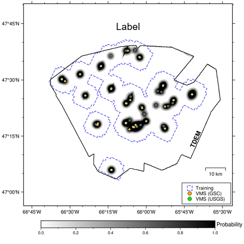
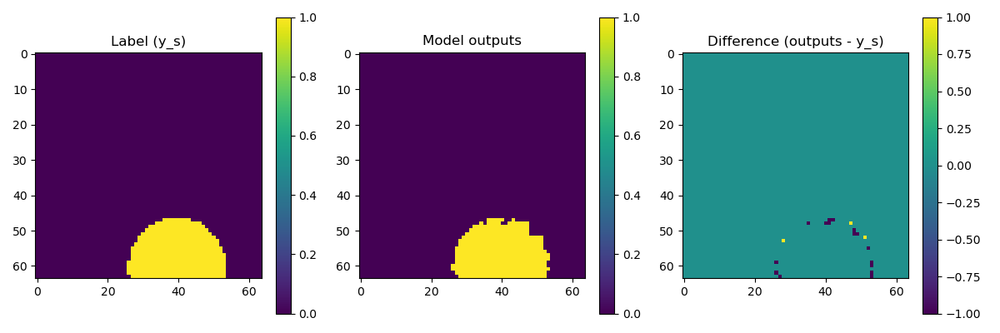

# GeoVMS

[](https://doi.org/10.5281/zenodo.20594792)

**Data-Driven Volcanogenic Massive Sulfide (VMS) Prospectivity Mapping and Uncertainty Quantification**

GeoVMS is an open-source repository that provides the code for our research paper. If you use this repository in your research, please cite the associated paper.

> Ding, L., et al. (2026). *Bayesian Deep Learning for Data-Driven Volcanogenic Massive Sulfide Prospectivity Mapping and Uncertainty Quantification*. Submitted.


<p align="center">
  
</p>

<p align="center"><em>Example application to the Bathurst Mining Camp, Canada</em></p>

---

## Repository Structure

```text
geovms/
    ├── checkpoints/              # Pre-trained model
    ├── docs/                     # Documentations
    │   └── figs/                 
    ├── examples/                 # Example data
    │   └── reference/            # Reference result
    ├── geovms/                   # Main folder
    │   ├── configs/              # Configuration files
    │   ├── dataloader/           # The dataloader
    │   ├── models/               # The Swin-Transformer based UNet
    │   ├── train.py              # Training script
    │   ├── inference.py          # Inference script
    │   ├── predict.py            # Prediction example, using inference.py  
    │   └── plot_prediction.py    # Visualization script
    ├── README.md
    ├── LICENSE
    └── ...
```

---

## Installation

- For basic installation:
```shell
    git clone https://github.com/Liang-Ding/geovms.git
    cd geovms
    pip install -e .
```


---

## Quick Start

### Run the example with pre-trained model

#### 1. Download the pre-trained model (file name: vms_final_model.pth)

> *https://www.dropbox.com/scl/fi/527henlw44u06tlsrat34/vms_final_model.pth?rlkey=4k4fsgf6ic2pz5qyk52kfeklt&st=k9sq2yjc&dl=0*

#### 2. Place the pre-trained model file in the checkpoint directory

```bash
geovms/checkpoints/vms_final_model.pth
```

#### 3. Run prediction example

```bash
cd geovms/geovms
python predict.py --config ./configs/config.yaml
```

#### 4. Visualize the prediction result

```bash
python plot_prediction.py
```

---

## Example Output

Reference result: label, model output, and their difference.

<p align="center">
  
</p>

---


